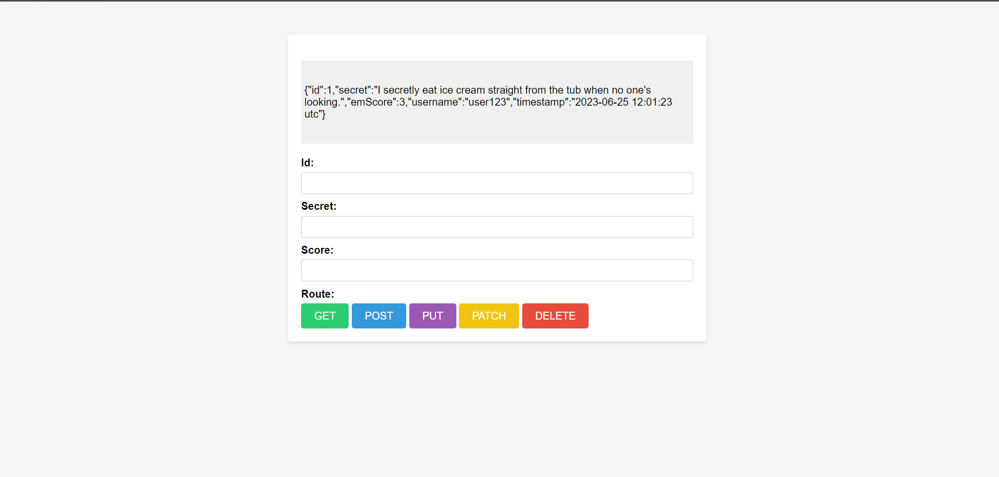

# REST API Project

This project demonstrates the creation and understanding of RESTful APIs using Node.js, Express, Axios, body-parser, and EJS. It includes endpoints for ```GET```, ```POST```, ```PUT```, ```PATCH``` and ```DELETE``` resources.

### To Install Dependencies

```
npm i 

or

npm install
```

## Necessary NPM Packages or Dependencies

* Axios => [axios](https://www.npmjs.com/package/axios).

* EJS (Embedded Javascript => [ejs](https://www.npmjs.com/package/ejs).

* Express => [express](https://www.npmjs.com/package/express).

* Bodyoparser => [body-parser](https://www.npmjs.com/package/ejs).


### To start the server 

```
nodemon server.js 

or

node server.js
```


### Usage

###### GET Request

* Retrieve a list of items.

###### POST Request

* Create a new item.

###### PUT Request

* Update an existing item entirely.

###### PATCH Request

* Update part of an existing item.

###### DELETE Request

* Delete an item.

##### JSON.stringify(result.data)

The ```JSON.stringify(result.data)``` is used to convert the JavaScript object (in this case, result.data) into a JSON string. This is useful for a variety of reasons, such as:

1. **Logging:** When you want to log the data for debugging purposes, converting it to a JSON string makes it more readable.

2. **Storage:** If you need to store the data in a format that can be easily transferred or saved, JSON is a good choice.

3. **Sending Data:** When sending data over HTTP or other protocols, JSON strings are commonly used.

## Screenshots



## Licence 

[MIT](https://choosealicense.com/licenses/mit/)
